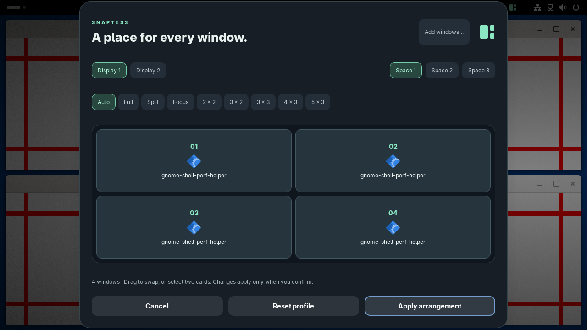

<div align="center">

# SnapTess

**Your windows, beautifully arranged.**

Automatic window tiling for **GNOME Shell 50 · Wayland**.

[](https://github.com/C0sm0cats/SnapTess/actions/workflows/check.yml)
[](LICENSE)
[](metadata.json)

**One shortcut to arrange. One shortcut to give your desktop back.**

</div>



SnapTess brings the workflow of [SmartGrid for Windows](https://github.com/C0sm0cats/SmartGrid) to GNOME as a standalone extension. No Python daemon, root access, or unsafe Shell mode. It starts paused: enabling the extension does not rearrange your windows.

> **0.1 preview:** GNOME Shell 50 is the supported target. This is not a universal Linux window manager, and it does not claim exact Windows behavior. See the [porting matrix](docs/PORTING.md).

## What it does

- **Automatic layouts:** full, split, 60/40 focus-and-stack, and grids through 5×3. Larger window sets expand beyond 15 slots instead of silently leaving windows behind.
- **Layout Studio:** a desktop overlay with application icons, numbered slots, click-to-swap and drag-to-swap, layout presets, display/space selection, and a window library for assigning windows across displays. Edits stay in a draft until applied.
- **Drag to snap:** move a tiled window by its title bar, see the translucent target, and release. Same-display drops swap; cross-display drops insert and reflow both displays.
- **Three spaces per display:** independent window groups within each native GNOME workspace. Switching parks windows with native minimization; stopping reveals and restores them.
- **Stay in control:** floating windows, app exclusions, configurable compaction, maximize/fullscreen freeze, focused-window outline, animated guides, saved layout/app order, and ten-level arrangement undo.

## Install

Requires GNOME Shell **50**, `gnome-extensions`, and `glib-compile-schemas`. No Node.js is needed to run the extension.

```bash
git clone https://github.com/C0sm0cats/SnapTess.git
cd SnapTess
./scripts/install.sh
```

On first installation, GNOME may need a **logout and login** to discover the extension. If the installer asks for it, then run:

```bash
gnome-extensions enable snaptess@c0sm0cats.github.io
```

Open the grid icon in the top panel, or press **Ctrl+Alt+T** to begin arranging. **Ctrl+Alt+P** opens Layout Studio. Stop with **Ctrl+Alt+Q** to restore the original window geometry.

If another tiling extension is enabled, disable its automatic placement and overlapping shortcuts before using SnapTess. The installer never changes other extensions.

### Install a packaged build

Download the `.shell-extension.zip` from [Releases](https://github.com/C0sm0cats/SnapTess/releases), then:

```bash
gnome-extensions install --force snaptess@c0sm0cats.github.io.shell-extension.zip
```

The same first-install logout/login requirement applies. To remove SnapTess:

```bash
gnome-extensions disable snaptess@c0sm0cats.github.io
gnome-extensions uninstall snaptess@c0sm0cats.github.io
```

## Shortcuts

All shortcuts can be changed in Preferences. In swap mode, use the arrow keys and finish with Escape or Enter.

| Shortcut | Action |
|---|---|
| Ctrl+Alt+T | Start / stop tiling and restore |
| Ctrl+Alt+P | Layout Studio |
| Ctrl+Alt+R | Arrange again |
| Ctrl+Alt+F | Float / tile the focused window |
| Ctrl+Alt+S | Enter / leave swap mode |
| Ctrl+Alt+Z | Undo the last manual arrangement |
| Ctrl+Alt+1 / 2 / 3 | Switch space on the focused display |
| Ctrl+Alt+Q | Stop and restore windows |

## How spaces and profiles work

Spaces are **session-local window groups**, not replacement GNOME workspaces. Each native workspace has its own three groups per display. Windows opened in a group belong to that group. Manually opening a parked window from the dock brings it into the current group. Windows you minimized yourself remain minimized when switching groups.

Layouts and application order are saved by native workspace index, monitor connector and space number. Profiles reorder **existing** windows; they do not launch applications or restore a desktop session after login. Multiple windows from the same app retain their current relative order.

Maximizing or fullscreening a managed window freezes automatic layout changes on that display. Restoring resumes tiling. Explicitly applying a layout can unmaximize windows; it never exits fullscreen. Applications can impose minimum window sizes, which GNOME enforces.

## Development

```bash
npm test                  # geometry and slot reconciliation; no dependencies
./scripts/build.sh        # dist/snaptess@c0sm0cats.github.io.shell-extension.zip
./scripts/test-shell.sh   # real GNOME 50 headless integration test
```

The Shell test runs on a private session bus with temporary XDG directories. It does not load SnapTess into your current desktop. Test logs from system services can contain unrelated portal/accessibility warnings; SnapTess assertions fail the process.

For the two-monitor integration test:

```bash
dbus-run-session -- gnome-shell-test-tool --headless --disable-animations \
  --wrap scripts/two-monitors.sh \
  --extension dist/snaptess@c0sm0cats.github.io.shell-extension.zip tests/shell.js
```

`lib/layout.js` has no GNOME imports. `extension.js` owns the GNOME adapter and lifecycle; `lib/studio.js` owns the modal editor; `prefs.js` uses GTK4/libadwaita. Other desktop backends may be added later without changing the project's name.

## Contributing

Report your GNOME version, app IDs, monitor resolutions/scales, and exact steps in [an issue](https://github.com/C0sm0cats/SnapTess/issues). Include whether the problem concerns Wayland or XWayland windows. See [CONTRIBUTING.md](CONTRIBUTING.md) for local checks.

## Credits

Created by [C0sm0cats](https://github.com/C0sm0cats). Layout rules and workflow adapted from SmartGrid. MIT licensed; the original SmartGrid copyright notice is preserved in [LICENSE](LICENSE).
