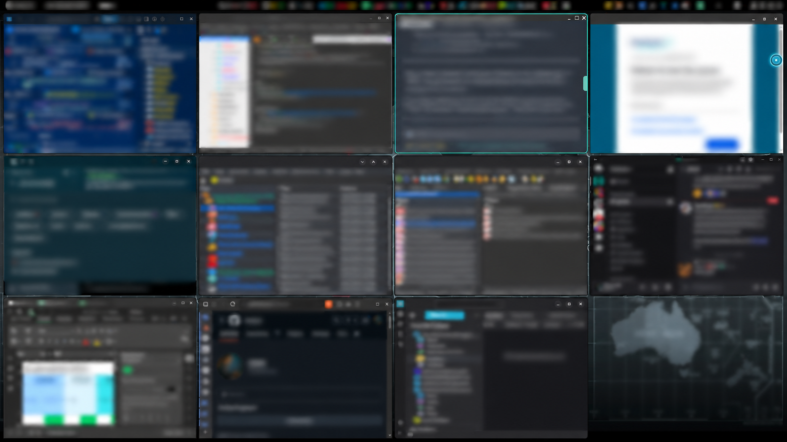

<div align="center">

# SnapTess

**Your windows, beautifully arranged.**

Automatic window tiling for **GNOME Shell 50 · Wayland**.

[](https://github.com/C0sm0cats/SnapTess/actions/workflows/check.yml)
[](LICENSE)
[](metadata.json)

**One shortcut to arrange. One shortcut to give your desktop back.**

</div>



SnapTess is a standalone GNOME Shell extension. It starts paused: enabling it does not rearrange your windows.

## What it does

- **Automatic layouts:** full, split, 60/40 focus-and-stack, and grids through 5×3. Larger window sets expand beyond 15 slots instead of silently leaving windows behind.
- **Layout Studio:** a desktop overlay with application icons, numbered slots, drag-to-swap, layout presets, display/space selection, and a window library for assigning windows across displays. Edits stay in a draft until applied.
- **Drag to snap:** move a tiled window by its title bar, see the translucent target, and release. Same-display drops swap; cross-display drops insert and reflow both displays.
- **Three spaces per display:** independent window groups within each native GNOME workspace. Switching parks windows with native minimization; stopping reveals and restores them.
- **Stay in control:** floating windows, app exclusions, configurable compaction, maximize/fullscreen freeze, focused-window outline, animated guides, saved layout/app order, and ten-level arrangement undo.

## Install

Requires GNOME Shell **50** on Wayland and the `gnome-extensions` command. No build tools or source checkout are needed.

Download `snaptess@c0sm0cats.github.io.shell-extension.zip` from the [latest release](https://github.com/C0sm0cats/SnapTess/releases/latest). In the folder containing the downloaded ZIP, run:

```bash
gnome-extensions install --force snaptess@c0sm0cats.github.io.shell-extension.zip
```

On first installation, log out and back in so GNOME discovers the extension. Then enable SnapTess in the Extensions app or run `gnome-extensions enable snaptess@c0sm0cats.github.io`.

Open the grid icon in the top panel, or press **Ctrl+Alt+T** to begin arranging. **Ctrl+Alt+P** opens Layout Studio. Stop with **Ctrl+Alt+Q** to restore the original window geometry.

If another tiling extension is enabled, disable its automatic placement and overlapping shortcuts before using SnapTess. To remove SnapTess:

```bash
gnome-extensions disable snaptess@c0sm0cats.github.io
gnome-extensions uninstall snaptess@c0sm0cats.github.io
```

## Shortcuts

All shortcuts can be changed in Preferences. In swap mode, use the arrow keys and finish with Escape or Enter.

| Shortcut | Action |
|---|---|
| Ctrl+Alt+T | Start / stop tiling and restore |
| Ctrl+Alt+P | Layout Studio |
| Ctrl+Alt+R | Arrange again |
| Ctrl+Alt+F | Float / tile the focused window |
| Ctrl+Alt+S | Enter / leave swap mode |
| Ctrl+Alt+Z | Undo the last manual arrangement |
| Ctrl+Alt+1 / 2 / 3 | Switch space on the focused display |
| Ctrl+Alt+Q | Stop and restore windows |

## How spaces and profiles work

Spaces are **session-local window groups**, not replacement GNOME workspaces. Each native workspace has its own three groups per display. Windows opened in a group belong to that group. Manually opening a parked window from the dock brings it into the current group. Windows you minimized yourself remain minimized when switching groups.

Layouts and application order are saved by native workspace index, monitor connector and space number. In Studio, select a window and choose **Keep this app in this tile** to reserve its place when it closes and reopens; the tile stays empty while the app is absent. Apply saves changes made across all edited displays and spaces as one undoable arrangement. These everyday space profiles reorder **existing** windows; changing a preset or space never launches applications. Multiple windows from the same app retain their current relative order.

**Saved layouts** are separate named templates in Studio. Save the current draft, select a template to preview its apps and pins, then explicitly choose **Restore in this space**. Restore reuses matching windows in the selected space, launches missing apps when available, restores only the pins chosen in Studio, and minimizes surplus windows without closing them. Undo restores the previous arrangement and minimized state, but does not close newly launched apps. A deleted named layout has its own **Undo delete** action in Studio. Missing or unavailable apps leave their tiles empty; pinned tiles remain reserved. This is an on-demand layout reconstruction, not automatic session or document restoration after login.

Maximizing or fullscreening a managed window freezes automatic layout changes on that display. Restoring resumes tiling. Explicitly applying a layout can unmaximize windows; it never exits fullscreen. Applications can impose minimum client sizes, which GNOME still enforces. If a requested tile is smaller, SnapTess keeps the real client at an allowed size and uniformly scales its compositor actor into the slot, preventing overlap while preserving aspect ratio.

## Contributing

Report your GNOME version, app IDs, monitor resolutions/scales, and exact steps in [an issue](https://github.com/C0sm0cats/SnapTess/issues). Include whether the problem concerns Wayland or XWayland windows.

## Credits

Created by [C0sm0cats](https://github.com/C0sm0cats). MIT licensed; see [LICENSE](LICENSE).
