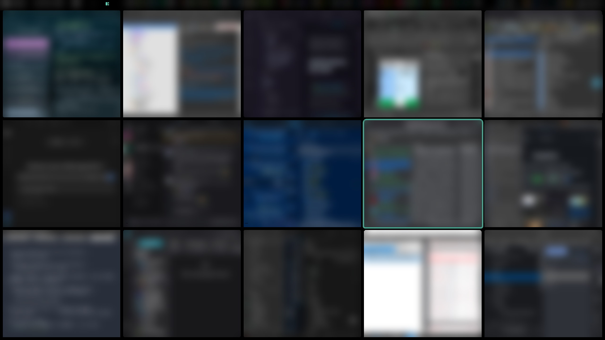

<div align="center">

# SnapTess

**Your windows, beautifully arranged.**

Automatic window tiling for **GNOME Shell 50 · Wayland**.

[](https://github.com/C0sm0cats/SnapTess/actions/workflows/check.yml)
[](LICENSE)
[](metadata.json)

**One shortcut to arrange. One shortcut to give your desktop back.**

</div>



SnapTess is a standalone GNOME Shell extension. It starts paused: enabling it does not rearrange your windows.

## What it does

- **Automatic layouts:** full, split, 60/40 focus-and-stack, and grid presets through 5×5. Auto expands beyond 25 slots as more windows open.
- **Layout Studio:** a desktop overlay with application icons, numbered slots, drag-to-swap, layout presets, display/space selection, and a window library for assigning windows across displays. Create a named layout from a built-in preset or design custom tiles with splits, merges and percentage dimensions. Edit saved templates or the current space. Edits stay in a draft until applied or saved.
- **Quick layout switcher:** open it from the panel menu or press Ctrl+Alt+L. See how many windows each saved layout will reuse, open, or hide before applying it to the focused display and space. Switch to Auto or a compatible preset without opening apps.
- **Drag to snap:** move a tiled window by its title bar, see the translucent target, and release. Same-display drops swap; cross-display drops insert and reflow both displays.
- **Directional focus:** press Ctrl+Super+arrow to activate a neighboring tiled window without moving it. Keep typing immediately; no navigation mode is needed.
- **Linked tile resize:** drag a shared window edge or corner to resize neighboring tiles, with movement continuing into further tiles when a neighbor reaches its minimum. Proportions are saved for that display and space. Undo restores the previous arrangement; Arrange again (Ctrl+Alt+R) resets the proportions.
- **Three spaces per display:** independent window groups within each native GNOME workspace. Switching parks windows with native minimization; stopping reveals and restores them.
- **Stay in control:** floating windows, app exclusions, configurable compaction, maximize/fullscreen freeze, focused-window outline, animated guides, saved layout/app order, and ten-level arrangement undo.
- **Pinned slots:** a compact card marks a reserved tile when its app is minimized, floating, or closed. Click it to restore, retile, or reopen the app; unpinned empty tiles stay clear.
- **Import and export:** save named layouts and per-space profiles as a JSON file from Preferences, then import them on another installation. Import adds layouts and profiles without replacing existing ones.

## Install

Requires GNOME Shell **50** on Wayland and the `gnome-extensions` command. No build tools or source checkout are needed.

Download `snaptess@c0sm0cats.github.io.shell-extension.zip` from the [latest release](https://github.com/C0sm0cats/SnapTess/releases/latest). In the folder containing the downloaded ZIP, run:

```bash
gnome-extensions install --force snaptess@c0sm0cats.github.io.shell-extension.zip
```

On first installation, log out and back in so GNOME discovers the extension. Then enable SnapTess in the Extensions app or run `gnome-extensions enable snaptess@c0sm0cats.github.io`.

Open the grid icon in the top panel, or press **Ctrl+Alt+T** to begin arranging. **Ctrl+Alt+P** opens Layout Studio. Stop with **Ctrl+Alt+Q** to restore the original window geometry.

If another tiling extension is enabled, disable its automatic placement and overlapping shortcuts before using SnapTess. To remove SnapTess:

```bash
gnome-extensions disable snaptess@c0sm0cats.github.io
gnome-extensions uninstall snaptess@c0sm0cats.github.io
```

## Shortcuts

All shortcuts can be changed or disabled in Preferences. Super is usually the Windows key.

| Shortcut | Action |
|---|---|
| Ctrl+Alt+T | Start / stop tiling and restore |
| Ctrl+Alt+P | Layout Studio |
| Ctrl+Alt+L | Change layout |
| Ctrl+Alt+R | Arrange again and reset manually resized tile proportions |
| Ctrl+Alt+F | Float / tile the focused window |
| Ctrl+Alt+S | Enter / leave swap mode |
| Ctrl+Super+← / → / ↑ / ↓ | Focus the tiled window to the left / right / above / below |
| Ctrl+Alt+Z | Undo the last manual arrangement |
| Ctrl+Alt+1 / 2 / 3 | Switch space on the focused display |
| Ctrl+Alt+Q | Stop and restore windows |

**Focus navigation:** while tiling is active, Ctrl+Super+arrow activates a visible tiled window on the same display and in the current SnapTess space. It skips empty, minimized and floating tiles, prefers windows in the same row or column, and uses the current geometry after resizing. With no window in that direction, focus stays put; it never wraps around or switches spaces. These defaults avoid GNOME's Ctrl+Alt+arrow workspace shortcuts. Focus navigation is inactive during swap, drag/resize, Overview and the layout dialogs.

**Swap mode:** Ctrl+Alt+S starts a mode in which plain arrow keys exchange window positions. Enter (or Ctrl+Alt+S again) keeps the changes; Escape cancels them. Use directional focus to choose where to type and swap mode to rearrange windows.

## Appearance preferences

- **Make room:** keep one common screen margin or enable separate top, right, bottom and left margins. Window spacing controls the gaps between tiles independently. The live preview reflects these settings.
- **Focus outline:** follow the GNOME accent or choose a custom color, set thickness from 1 to 6 pixels, and choose a plain outline or subtle halo. Each corner continues to follow the window shape.
- **Animations:** choose Fast, Normal, Slow or a custom base duration (40–500 ms), with ease out, linear or ease in and out motion. These settings affect guides, focus effects, Studio and space transitions; native window placement stays immediate. Disable animations with “Animate placement guides”.

## How spaces and profiles work

Spaces are **session-local window groups**, not replacement GNOME workspaces. Each native workspace has its own three groups per display. Windows opened in a group belong to that group. Manually opening a parked window from the dock brings it into the current group. Windows you minimized yourself remain minimized when switching groups.

Layouts and application order are saved by native workspace index, monitor connector and space number. In Studio, select a window and choose **Keep this app in this tile** to reserve its place when it closes and reopens; the tile stays empty while the app is absent. Apply saves changes made across all edited displays and spaces as one undoable arrangement. These everyday space profiles reorder **existing** windows; changing a preset or space never launches applications. Multiple windows from the same app retain their current relative order.

**Saved layouts** are separate named templates in Studio. Save the current draft, or choose **New layout** to start from a blank built-in preset or **Custom**. Select installed apps for individual tiles, leave any tiles empty, and pin apps independently. Saving a new layout leaves the desktop untouched. Saved layouts are sorted by tile count in Studio and the quick switcher. Select a template to preview it, rename it with **Rename layout**, or explicitly choose **Restore in this space**. Restore reuses matching windows in the selected space, launches missing apps when available, restores only the pins chosen in Studio, and minimizes surplus windows without closing them. Undo restores the previous arrangement and minimized state, but does not close newly launched apps. A deleted named layout has its own **Undo delete** action in Studio. Missing or unavailable apps leave their tiles empty; pinned tiles remain reserved. This is an on-demand layout reconstruction, not automatic session or document restoration after login.

### Build a custom layout

1. Open **Layout Studio → New layout → Custom**. Start with one tile covering the available space.
2. Select a tile and use **Split vertically** (left/right) or **Split horizontally** (top/bottom). Drag the green divider handles, or edit **X, Y, Width and Height** in percent; press Enter or leave the field to commit. Shared edges adjust neighboring tiles, keeping complete coverage without overlaps. Outer edges remain fixed. Tiles have a minimum width and height of 3%, with up to 30 tiles.
3. Use **Merge tiles** and select a highlighted neighbor to combine two tiles into one rectangle. If both tiles have an app assigned, choose which app to keep. **Undo** restores geometry, assignments and pins.
4. Choose an installed app for each tile, leave tiles empty or pin assignments, then **Save layout…**. Saving does not move windows or launch apps. Select **Edit layout** in a saved template's preview to change it later.
5. Use **Restore in this space** or the quick layout switcher to apply the template. Custom geometry is included in JSON export/import and scales to the destination display, with your normal margins and gaps.

Custom layouts retain directional focus, swap and linked resizing. **Arrange again** resets temporary divider changes to the custom template's saved proportions. If more windows need placement than the custom layout has tiles, the existing Auto fallback arranges them; the custom definition is retained. To change the base geometry permanently, edit and restore the named layout.

Studio dims presets with too few tiles for the current draft. Selecting one explains the required capacity without changing the draft. A new layout needs enough tiles to keep every assigned app in its chosen position.

The **quick layout switcher** keeps **Arrange open windows** visible above the saved layouts. Select a saved layout to apply it after reviewing its effects. Escape cancels. Arrange open windows and built-in presets rearrange existing windows without launching apps; the automatic option also brings back windows that a saved layout hid. Other compatible presets are collapsed until opened, and the list indicates how many smaller presets are hidden.

In **Preferences → Back up and share**, export a `snaptess-layouts.json` file or import one. Import renames conflicting layouts with an “(imported)” suffix and keeps existing profiles for matching space keys. Profiles are tied to a GNOME workspace index, display connector and SnapTess space, so a profile copied to another computer applies only when those keys match. Named layouts can be restored on any display from Studio or the quick switcher. Import does not rearrange the desktop or launch applications.

Maximizing or fullscreening a managed window freezes automatic layout changes on that display. Restoring resumes tiling. Explicitly applying a layout can unmaximize windows; it never exits fullscreen. Applications can impose minimum client sizes, which GNOME still enforces. If a requested tile is smaller, SnapTess keeps the real client at an allowed size and uniformly scales its compositor actor into the slot, preventing overlap while preserving aspect ratio.

## Contributing

Report your GNOME version, app IDs, monitor resolutions/scales, and exact steps in [an issue](https://github.com/C0sm0cats/SnapTess/issues). Include whether the problem concerns Wayland or XWayland windows.

## Credits

Created by [C0sm0cats](https://github.com/C0sm0cats). MIT licensed; see [LICENSE](LICENSE).
